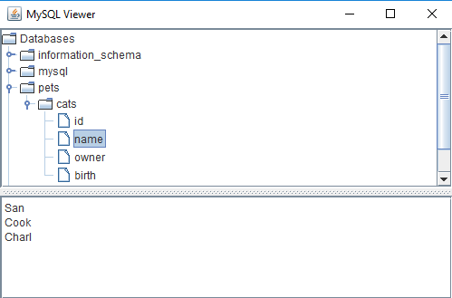

# DatabaseViewer

The program <a href="./TreeMySQL.java">here</a> includes:
 
&nbsp;&nbsp;1) A class for automated access to MySQL databases (without knowing the numbers or the names of databases, tables, or fields) and also
 
&nbsp;&nbsp;2) A modified version of the Oracle <a href="https://docs.oracle.com/javase/tutorial/uiswing/examples/components/TreeDemoProject/src/components/TreeDemo.java">TreeDemo</a> Program for modelling and visualization of the retrieved databases.
  

Link to the original Oracle program:
 
https://docs.oracle.com/javase/tutorial/uiswing/examples/components/TreeDemoProject/src/components/TreeDemo.java
  

Quoted copyright notice of the original Oracle program:
 
<i>"Copyright (c) 1995, 2008, Oracle and/or its affiliates. All rights reserved."</i>
  

